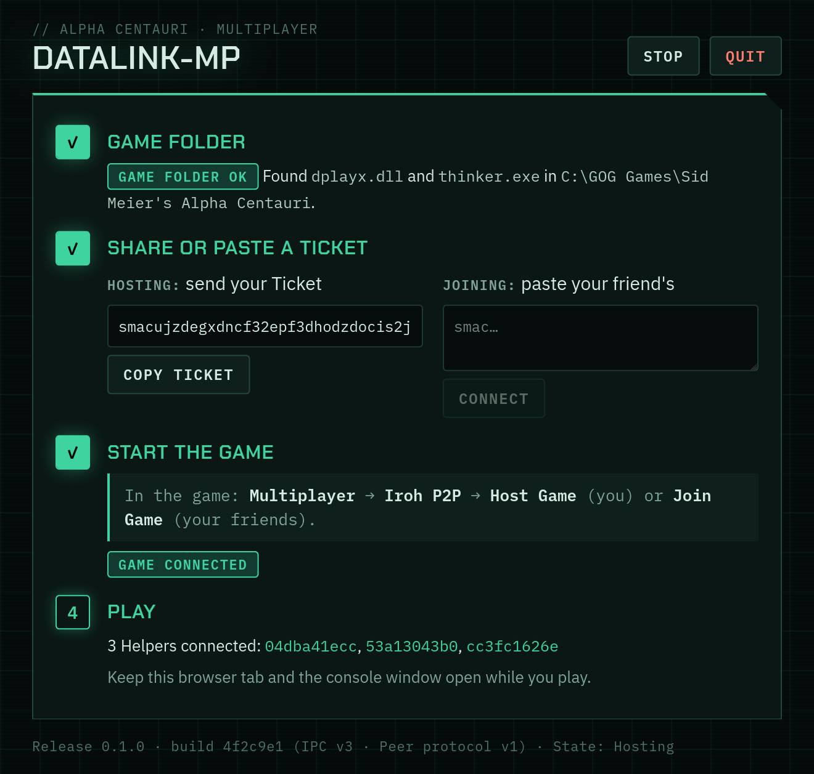
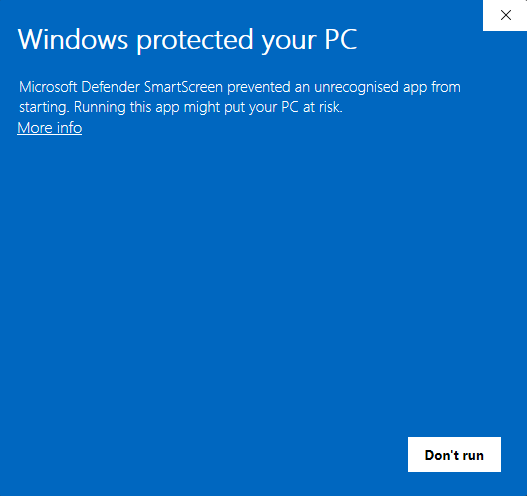
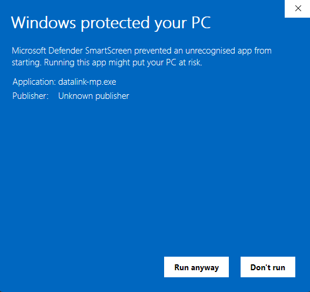
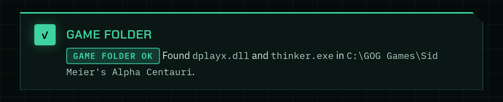
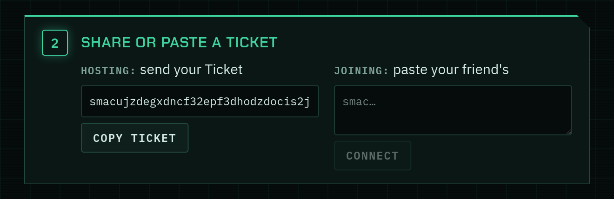
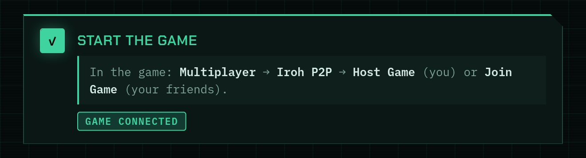
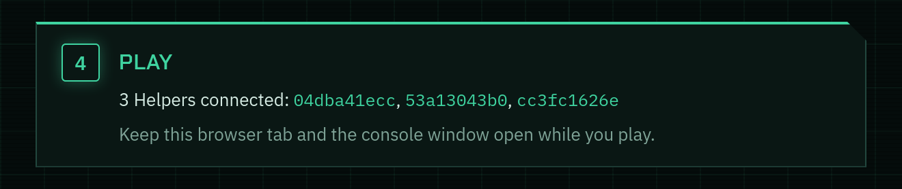

# datalink-mp

Play **Sid Meier's Alpha Centauri** (1999) online with your friends. No port
forwarding, no VPN, no IPX emulator: one of you shares a Ticket, the others
paste it, and you are connected.

You extract one archive into your Game folder and double-click `datalink-mp`.
Your browser opens a page with four numbered steps that tick off as you go.
You never need a terminal to play.

Based on smac-iroh by Henry de Valence.

datalink-mp has two parts: a replacement `dplayx.dll` (the DLL) that the game
loads instead of its own DirectPlay, and a small program (the Helper, the
`datalink-mp` you double-click) that talks to your friends' Helpers over
[Iroh](https://www.iroh.computer/): QUIC, hole-punching and relays included.

## What has been tested

This README claims only what has been tested.

| System | Status |
|---|---|
| Windows | Tested |
| Linux, through Faugus | Tested |
| Linux, through the shell under GE-Proton | Tested |
| Linux, through Steam, Lutris or plain system Wine | Should work; not tested |
| macOS | **Untested** (any Wine, for example CrossOver, should work) |

## Quickstart

**All systems, first:** You need Sid Meier's Alpha Centauri with
[Thinker](https://github.com/induktio/thinker) or
[PRACX](https://github.com/DrazharLn/pracx). Everyone playing needs the same
release of datalink-mp.

Download the archive for your system from the
[latest release](https://github.com/BlinkingApe/datalink-mp/releases/latest)
and follow the section for your system.

### Windows

1. Extract the whole zip into your Game folder, the one containing
   `thinker.exe`, `terran_PRACX.exe` or `wtp.exe`.
2. Double-click `datalink-mp.exe`. Windows will say it doesn't recognise the
   app: choose **More info** → **Run anyway**. If the firewall asks, allow
   access.

   
   

3. Your browser opens the datalink-mp page. Follow the four steps.
4. Keep the console window open while you play.

### Linux

1. Extract the whole `.tar.gz` into your Game folder.
2. In your launcher, add the Wine override: `WINEDLLOVERRIDES="dplayx=n,b"`
   (Faugus: paste it unquoted into Game Arguments).
3. Double-click `datalink-mp` and choose Run.
4. Your browser opens the page. Follow the four steps.

Keep the browser tab open while you play. Closing it doesn't stop the Helper;
the Quit button on the page does.

The override is needed because Wine uses its own `dplayx.dll` unless you tell
it to use ours. The page shows the override with Copy buttons.

- **Tested:** Faugus, and the shell under GE-Proton.
- **Should work, not tested:** Steam (put `WINEDLLOVERRIDES="dplayx=n,b"
  %command%` in the launch options), Lutris and plain system Wine (add the
  override to the launch environment).

### macOS (untested)

Nobody has run these steps on a Mac. They are what should work.

1. Extract the zip into your Game folder inside your Wine bottle. Any Wine
   should work (for example CrossOver). Bottles live under the hidden Library
   folder: in Finder choose Go → Go to Folder (⇧⌘G).
2. Add the Wine override to your launcher: `WINEDLLOVERRIDES="dplayx=n,b"`.
3. Double-click `datalink-mp`. macOS will block it the first time: open System
   Settings → Privacy & Security, choose **Open Anyway**, enter your password,
   then double-click it again.
4. A Terminal window opens and must stay open. Your browser opens the page.

## The four steps on the page

1. **Game folder.** The page confirms that `dplayx.dll` and your game
   executable are next to `datalink-mp`. On Linux and macOS this step also
   shows the Wine override.

   

2. **Share or paste a Ticket.** Your own Ticket is there from the start, with a
   Copy button. To host, send it to your friends. To join, paste your friend's
   Ticket into the box and press Connect.

   

3. **Start the game.** Choose Multiplayer → Iroh P2P → Host Game (if you are
   hosting) or Join Game (if you are joining). A pill on the page shows "Game
   connected" once the game has found datalink-mp.

   

4. **Play.** The page shows who is connected.

   

Your Ticket is new every time datalink-mp starts and every time you press
**Stop**, so share it again after either. Stop ends your current connections
and gives you a new Ticket without closing datalink-mp; with the game open,
return to the game's main menu first. Stopping during a game ends it for
everyone connected through you, and can crash their game. **Quit** closes
datalink-mp.

If you double-click `datalink-mp` while it's already running, the running copy
makes way and a fresh one starts, so you always get the copy you just started
(handy after extracting a new release). If the game or a friend is connected to
the running copy, it keeps running instead, and its page opens to say why.
The page's footer shows the Release version and the build, so you can check
which one is running.

## Troubleshooting

### Windows says Smart App Control blocked the app

Smart App Control blocks unsigned apps, and datalink-mp is unsigned. It is
different from the SmartScreen warning in the Windows quickstart, which you can
click through. The only workaround is turning Smart App Control off (Windows
Security → App & browser control → Smart App Control settings). Smart App
Control has not been tested with datalink-mp.

### The page says `dplayx.dll` may have been quarantined

Your antivirus may have removed `dplayx.dll` from the Game folder, because it
is a replacement DLL that hooks into the game. Restore it from your antivirus's
quarantine, or extract the archive into your Game folder again, and consider
excluding the Game folder from scanning. The page notices the DLL is back
within a second or so; you don't need to restart datalink-mp.

The same banner appears when you ran `datalink-mp` from the wrong folder (for
example Downloads). The page shows where it is running from. Extract the whole
archive into your Game folder and run it from there.

### The game never shows "Game connected"

The game isn't loading our `dplayx.dll`.

- On Linux and macOS this is almost always the Wine override. Check that
  `WINEDLLOVERRIDES="dplayx=n,b"` is in the environment your launcher uses to
  start the game (in Faugus, unquoted, in Game Arguments).
- On every system, check that `dplayx.dll` sits in the same Game folder as the
  game executable you start (`thinker.exe`, `terran_PRACX.exe` or `wtp.exe`).
- If the page says the DLL doesn't match the Helper, extract the whole archive
  into your Game folder again and restart the game.

### Your friend can't connect

- Ask them for their current Ticket, not an old one: a Ticket changes every time
  its owner starts datalink-mp or presses Stop.
- Check that you both run the same release of datalink-mp. The page shows the
  Release version at the bottom; compare them. Players whose Release versions
  share a minor part (the middle number: the 2 in 1.2.3) can play together.

## For power users

You don't need any of this to play.

Running `datalink-mp` with no subcommand starts the web page, as
double-clicking does. Options in that mode:

| Option | Environment variable | Meaning |
|---|---|---|
| `--ui-port <PORT>` | `SMAC_UI_PORT` | Port of the web page (default 47700; if taken, the next nine are tried). The flag wins over the variable. |
| `--port <PORT>` | `SMAC_HELPER_PORT` | Port the game's DLL uses to reach the Helper (default 47624). Give two Helpers on one machine different ports, and start each game with the matching `SMAC_HELPER_PORT`. |
| `--no-browser` | | Don't open a browser; open the printed URL yourself. |
| | `SMAC_HELPER_LOG_FILE` | Write the log to this file. |

For scripts and headless use there are two subcommands that start no web page:

- `datalink-mp host` prints your Ticket as the first line of standard output
  and serves the game.
- `datalink-mp join --ticket <TICKET>` connects to a friend's Ticket and serves
  the game. It exits with an error if it can't reach them.

Both accept `--port`, and `SMAC_HELPER_PORT` works as above.

## Building from source

See [docs/contributors/building.md](docs/contributors/building.md). It also lists the diagnostic logs.

## How it works

The game does multiplayer through DirectPlay, a retired Windows API. The DLL
implements DirectPlay and forwards everything over localhost to the Helper,
which owns the Iroh endpoint. The split exists because Iroh cannot run inside
Wine. See [docs/contributors/architecture.md](docs/contributors/architecture.md)
for the design and
[docs/players/wine-compatibility.md](docs/players/wine-compatibility.md) for
the investigation.

Vanilla multiplayer colors units, flags and labels by seat, not faction;
datalink-mp fixes that so every faction wears its classic colors. See
[docs/players/faction-colors.md](docs/players/faction-colors.md).

## Contributing

To change the code or the docs, start at [CONTRIBUTING.md](CONTRIBUTING.md).

## Credits

Based on smac-iroh by Henry de Valence.

- [PRACX](https://github.com/DrazharLn/pracx) and
  [Thinker](https://github.com/induktio/thinker), the community patches that
  make the game work well on modern systems.
- [Iroh](https://github.com/n0-computer/iroh) by n0, the peer-to-peer layer.
- [quinn](https://github.com/quinn-rs/quinn), the QUIC implementation.
- The Wine project, whose open dplayx source made the DirectPlay surface
  tractable to reimplement.

## License

Dual-licensed under [MIT](LICENSE-MIT) or [Apache-2.0](LICENSE-APACHE), at
your option.

The page embeds the fonts [Chakra Petch](https://github.com/m4rc1e/Chakra-Petch)
and [IBM Plex](https://github.com/IBM/plex), under the SIL Open Font License
1.1: see [LICENSE-FONTS](LICENSE-FONTS).

Sid Meier's Alpha Centauri is a trademark of its respective owners. This
project is an unaffiliated interoperability layer and contains no game assets.
